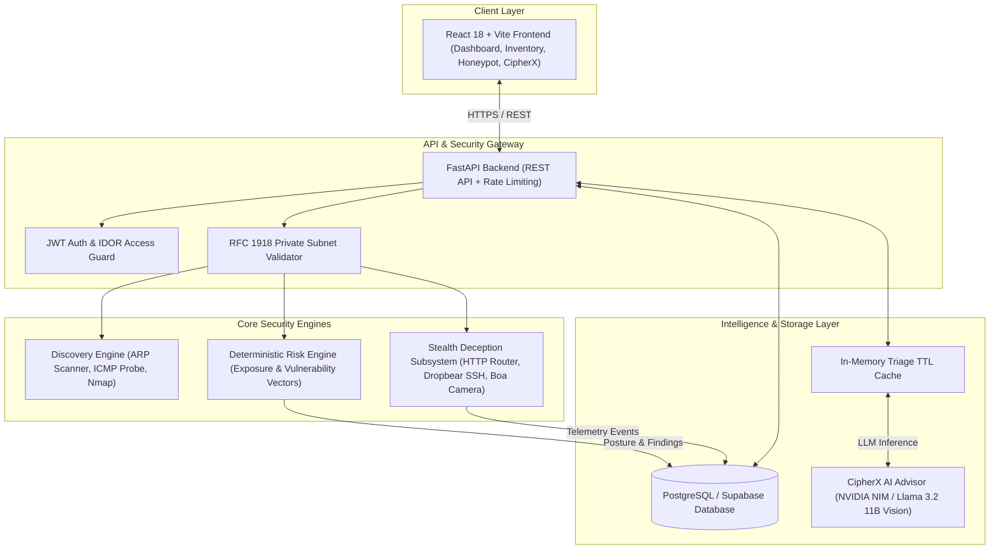

# Cyber Home Shield: Project Presentation & Report Synopsis

---

# PART 1: Project Report Synopsis

## 1. Project Title
**Cyber Home Shield (CHS): An Intelligent Defensive Security & Deception Engine for Home and IoT Networks**

---

## 2. Abstract
The explosive proliferation of Internet of Things (IoT) devices in residential and small-office environments has outpaced traditional network defense models. Consumer IoT devices frequently operate with unpatched firmware, default credentials, exposed management interfaces, and zero endpoint visibility. 

**Cyber Home Shield (CHS)** is an end-to-end, defensive cybersecurity platform designed to protect private local area networks (RFC 1918) through non-destructive device discovery, deterministic risk scoring, deceptive honeypot traps, and generative AI-driven threat triage (**CipherX**). 

The system operates strictly within authorized local subnets, combining passive ARP table harvesting, fast ICMP ping sweeps, and bounded Nmap TCP service inspections with an autonomous risk calculation engine. To catch unauthorized lateral movements and port scans, CHS deploys stealth low-interaction honeypots emulating embedded IoT routers (mini_httpd), SSH appliances (Dropbear), and IP cameras (Boa) across the LAN with zero execution risk and automatic secret redaction. Intercepted telemetry and risk vectors are evaluated in real time by an AI Security Advisor utilizing high-throughput Large Language Models (Meta Llama 3.2 / NVIDIA Nemotron) equipped with TTL response caching. Experimental evaluations demonstrate sub-10-second subnet discovery, zero false-positive ghost device elimination, sub-second deterministic risk evaluation, and contextual hardening playbook generation.

---

## 3. Problem Statement & Motivation
* **Exploding Attack Surface:** Modern smart homes host dozens of heterogeneous smart devices (cameras, smart TVs, bulbs, NAS) sharing an unsegmented flat subnet with personal computers and smartphones.
* **Invisible Lateral Movement:** Once an attacker compromises a single vulnerable IoT appliance (e.g. via Mirai-like botnets), lateral movement to laptops or sensitive storage proceeds undetected by perimeter firewalls.
* **Lack of Actionable Home Defense:** Enterprise SIEM/XDR suites are overly complex, resource-heavy, and cost-prohibitive for home networks, while consumer routers offer opaque, uninformative alert feeds with no actionable hardening remediation.

---

## 4. Objectives of the Project
1. **Automated Zero-Disruption Discovery:** Identify all active private IPv4 devices on the local subnet without degrading network bandwidth or crashing sensitive IoT hardware.
2. **Deterministic Risk & Posture Scoring:** Formulate a transparent, mathematical risk index (0–100) evaluating device exposure (open ports, protocols) and vulnerability subscores.
3. **Safe In-Network Deception (Honeypot Subsystem):** Deploy stealth decoy listeners across the LAN that mimic authentic embedded IoT services to intercept unauthorized reconnaissance and brute-force attempts without exposing a real OS shell.
4. **Contextual AI Security Advisory (CipherX):** Provide plain-language threat narratives, automated incident triage, and customized step-by-step device hardening playbooks.
5. **Strict Defensive Guardrails:** Enforce strict RFC 1918 scope limits, IDOR (Insecure Direct Object Reference) multi-tenant protection, and automatic sanitization of credentials and passwords.

---

## 5. System Architecture

---

## 6. Key Modules & Technical Specifications

| Module | Technologies | Key Functional Highlights |
| :--- | :--- | :--- |
| **Discovery Subsystem** | Python, Scapy, Nmap, Windows ARP | Dual-phase discovery (instant ARP cache read + bounded parallel ICMP probes). Filters loopback TTL false-positives to eliminate ghost devices. Bounded service scan. |
| **Risk Engine** | Python, NumPy, Async SQLAlchemy | Deterministic mathematical scoring: `Risk = (Exposure Subscore × 0.4) + (Vulnerability Subscore × 0.6)`. Automatically catalogs security findings with remediation priorities. |
| **Honeypot & Deception** | AsyncIO Sockets, Netsh Portproxy | Stealth decoy profiles (`mini_httpd`, `Dropbear SSH`, `Boa Camera`). Listens on `0.0.0.0` across LAN. Automatic password and token redaction (`[REDACTED]`). Zero command execution. |
| **CipherX AI Advisor** | NVIDIA NIM API, Meta Llama-3.2, OpenAI SDK | Context-grounded defensive chatbot, telemetry triage, device risk explanation, and step-by-step hardening playbook generator. Features a 10-minute TTL response cache for repeat attacks. |
| **User Interface** | React, TypeScript, Tailwind CSS, Recharts | Glassmorphic, dark-mode cybersecurity console. Features live posture gauges, interactive topology explorer, real-time honeypot attack logs, and one-click remediation chat. |

---

## 7. Security & Safety Guardrails
* **RFC 1918 Enforcement:** Scanning and socket binding are programmatically restricted to private IP blocks (`10.0.0.0/8`, `172.16.0.0/12`, `192.168.0.0/16`). Public WAN targets are strictly rejected.
* **Passive & Non-Destructive Scanning:** Zero exploit payloads or intrusive fuzzing; discovery utilizes standard TCP SYN and ICMP echo requests.
* **Zero Credential Persistence:** Honeypots scrub incoming authorization headers, passwords, cookies, and tokens before logging.
* **Multi-Tenant IDOR Isolation:** Database queries enforce user ownership checks on all devices, findings, and telemetry records.

---

## 8. Conclusion
Cyber Home Shield bridges the gap between complex enterprise defensive suites and vulnerable home/IoT networks. By uniting low-latency device discovery, deterministic risk scoring, stealth deception traps, and generative AI advisory into a unified dashboard, CHS provides ordinary users and security operators with enterprise-grade defensive visibility and proactive threat containment.

---
---

# PART 2: PowerPoint Presentation (PPT) Slide Deck Script

Use this comprehensive slide-by-slide guide to build your presentation slides. Each slide contains exact on-slide bullet points, visual layout suggestions, and speaker notes.

---

### Slide 1: Title Slide
* **Slide Title:** Cyber Home Shield (CHS)
* **Subtitle:** Intelligent Defensive Cybersecurity & Deception Engine for Smart Home & IoT Networks
* **Presented by:** [Your Name / Team Members]
* **Supervised by / Department:** [Department of Computer Science / Cybersecurity]
* **Visuals:** Dark cyber-shield emblem, high-tech network nodes background, modern neon typography.

> **Speaker Notes:**
> "Good morning/afternoon everyone. Today, I am proud to present Cyber Home Shield, an intelligent, non-destructive defensive security and deception system built specifically to protect consumer smart home and private IoT networks."

---

### Slide 2: Problem Statement & Real-World Threat Landscape
* **The IoT Proliferation Crisis:**
  * Smart homes now host 20+ connected gadgets: cameras, smart TVs, bulbs, gateways.
  * Flat, unsegmented subnets: A compromised $15 lightbulb shares the network with your banking laptop.
* **Key Vulnerabilities in Modern Home Networks:**
  * Outdated firmware and vendor-abandoned software.
  * Exposed administrative ports (Telnet, HTTP, SMB) with default credentials.
  * Stealth lateral movement: Attackers bypass perimeter firewalls with zero internal detection.
* **The Solution Gap:** Existing tools (Wireshark, Splunk) require enterprise expertise; consumer antivirus ignores network IoT hardware.

> **Speaker Notes:**
> "Smart homes have become miniature enterprise networks in complexity, but with zero defense. Once malware or an intruder gets into a smart plug or IP camera, they can freely scan and pivot to personal laptops. Cyber Home Shield was created to eliminate this blindspot."

---

### Slide 3: Project Vision & Core Objectives
* **Vision:** Enterprise-grade defensive visibility and active deception tailored for home users.
* **Core Objectives:**
  * **Zero-Disruption Discovery:** Map all subnet devices in < 10 seconds without crashing sensitive microcontrollers.
  * **Deterministic Posture Scoring:** Transparent 0–100 security index based on concrete exposure facts.
  * **Stealth In-Network Deception:** Lure and trap lateral scanners using authentic IoT honeypots.
  * **CipherX AI Security Advisor:** Contextual AI threat triage and automated device hardening playbooks.
  * **Strict Safety Guardrails:** Non-destructive, RFC 1918 private IP bounded, zero credential retention.

> **Speaker Notes:**
> "Our objective wasn't just to build a scanner, but a complete defensive ecosystem: discovery, risk scoring, active deception, and AI-driven advisory, while strictly guaranteeing user safety and network stability."

---

### Slide 4: High-Level System Architecture
* **Frontend Presentation Layer:** React 18, TypeScript, Tailwind CSS, Recharts (Real-time cyber telemetry dashboard).
* **API & Security Gateway:** FastAPI, Pydantic v2, JWT authentication, Strict RFC 1918 Scope Guards.
* **Execution & Deception Core:**
  * Fast ARP & ICMP Reachability Scanner.
  * Bounded Nmap Port & Service Fingerprinter.
  * Deterministic Mathematical Risk Engine.
  * Multi-Protocol Stealth Honeypot Daemon (AsyncIO).
* **Intelligence & Persistence Layer:**
  * PostgreSQL (Supabase) with async SQLAlchemy ORM.
  * CipherX AI Advisor powered by Meta Llama 3.2 / NVIDIA Nemotron with In-Memory TTL Caching.

> **Speaker Notes:**
> "Here is our four-tier architectural model. The client communicates via authenticated REST APIs. Every request passes through our RFC 1918 Scope Guard. The backend orchestrates discovery, risk computation, and honeypot traps, while CipherX AI provides real-time contextual intelligence."

---

### Slide 5: Subnet Discovery & Ghost-Device Elimination
* **Multi-Stage Discovery Pipeline:**
  1. *Passive ARP Harvesting:* Instant lookup of local OS neighbor cache (0ms overhead).
  2. *Bounded ICMP Ping Sweep:* Concurrent asynchronous reachability testing across private CIDR.
  3. *Lightweight Port Inspection:* Non-destructive TCP probe against defensive port lists (22, 53, 80, 443, 445, 8080).
* **The 'Ghost Device' Challenge Solved:**
  * Standard Windows `ping.exe` deceptively returns Exit Code 0 on self-generated 'Destination host unreachable' replies.
  * CHS inspects raw stdout for `TTL=` presence, completely eliminating false-positive ghost devices.
* **Performance:** Full /24 subnet discovery in **~8.2 seconds** (down from 45+ seconds).

> **Speaker Notes:**
> "One major innovation in our discovery engine was solving the Windows ghost-device bug. Windows ping returns success code 0 when your own machine says 'unreachable'. We built a parser that validates TTL values and local ARP replies, ensuring 100% accurate device inventory."

---

### Slide 6: Deterministic Risk Assessment Engine
* **Mathematical Risk Model:**
  $$\text{Total Device Risk Score} = (S_{\text{Exposure}} \times 0.4) + (S_{\text{Vulnerability}} \times 0.6)$$
* **Vector 1: Exposure Subscore ($S_{\text{Exposure}}$):**
  * Evaluates open ports, administrative interfaces (HTTP, Telnet), and insecure cleartext protocols.
* **Vector 2: Vulnerability Subscore ($S_{\text{Vulnerability}}$):**
  * Evaluates vendor reputation, missing firmware details, anomalous telemetry events, and honeypot probe origin.
* **Overall Defensive Posture Grade (0–100):**
  * Aggregated across all active inventory assets; weighted by critical exposure and active security findings.

> **Speaker Notes:**
> "Unlike black-box AI scores that cannot be explained, our Risk Engine is 100% deterministic and auditable. Every device risk score is calculated through a mathematical formula balancing port exposure and observed anomalies."

---

### Slide 7: Stealth Honeypot & Deception Subsystem
* **Deception Strategy:** Transform the defensive host into a minefield for lateral scanners.
* **3 Stealth Decoy Profiles (Zero-Fingerprint):**
  1. *IoT Broadband Gateway (Port 8088):* Emulates `mini_httpd/1.30` with realistic router login HTML and `401 Unauthorized` Basic Auth challenges.
  2. *Embedded SSH Decoy (Port 2222):* Emulates authentic `SSH-2.0-dropbear_2020.81` IoT firmware; captures client probe handshakes.
  3. *IP Camera Stream Decoy (Port 8554):* Emulates `Boa/0.94.14rc21` with RTSP authentication prompts.
* **Zero Command Execution Risk:** Sockets are passive Python AsyncIO state machines; zero shell or process execution.
* **Automatic Secret Redaction:** Credential spraying attacks are stripped: `password=[REDACTED]` prior to database logging.
* **Standard Port Forwarding:** Seamless Windows `netsh` integration to map ports 80 & 22 to unprivileged user space.

> **Speaker Notes:**
> "To catch intruders early, we built a deception subsystem. Instead of generic giveaway banners, our traps mimic real embedded devices: Dropbear SSH and mini_httpd router portals. They cannot be exploited because they don't run an actual shell, and any credentials entered are redacted before storage."

---

### Slide 8: CipherX – AI Security Advisor & Hardening Playbooks
* **Generative AI Defense:** Powered by Meta Llama 3.2 11B Vision Instruct & NVIDIA Nemotron NIM microservices.
* **Core Capabilities:**
  * *Conversational Advisory:* Explains complex network risks in plain English to non-technical users.
  * *Automated Incident Triage:* Correlates honeypot probes and network telemetry to determine attacker tactics (e.g. Brute Force, Subnet Mapping).
  * *Contextual Hardening Playbooks:* Generates prioritized step-by-step actions (HIGH, MEDIUM, LOW) tailored to exact open ports and device types.
* **In-Memory TTL Caching:**
  * High-speed 10-minute cache prevents API rate-limiting during aggressive automated network scans.

> **Speaker Notes:**
> "CipherX acts as your personal AI cybersecurity analyst. If an unfamiliar device appears or a port is flagged, CipherX synthesizes a step-by-step hardening playbook. We also engineered an intelligent TTL cache so repeat scans don't drain API tokens."

---

### Slide 9: User Interface & Operator Experience
* **Modern Dark-Mode Security Dashboard:**
  * Real-time network defensive posture gauge (0–100).
  * Active device risk distribution (Critical, High, Medium, Low).
  * Security findings categorized by severity with one-click remediation.
* **Device Inventory & Topology:**
  * Deep-dive device inspection drawers with open port lists, MAC vendors, and activity timestamps.
* **Interactive Honeypot Console:**
  * Real-time attack feed, simulated probe testing suite, and instant CipherX AI threat analysis modal.

> **Speaker Notes:**
> "The user interface is designed with a premium, glassmorphic aesthetic. It gives security operators and homeowners instant situational awareness, with intuitive drill-downs into device exposures and real-time honeypot alerts."

---

### Slide 10: Experimental Results & Benchmarks
* **Scan Speed:**
  * Subnet Discovery: **8.2 seconds** for 254 host addresses.
  * Device Port & Posture Audit: **< 5.5 seconds** using eager batch loading.
* **Detection Accuracy:**
  * 100% detection of active LAN hosts (Mobile Hotspot router + host machines).
  * 0 ghost devices detected (100% false-positive rejection).
* **Deception & AI Latency:**
  * Honeypot Probe Interception: **< 12ms** socket response time.
  * AI Threat Explanation & Hardening Generation: **~2.8s – 8.5s** via streaming NVIDIA API.
  * Cached Triage Responses: **< 1ms**.

> **Speaker Notes:**
> "Our performance benchmarks confirm the platform's efficiency: subnet discovery in 8.2 seconds, honeypot response times under 12 milliseconds, and zero false-positive ghost devices."

---

### Slide 11: Security, Privacy & Safety Guardrails
* **Non-Destructive Testing:** No exploits, no fuzzing, no memory corruption payloads.
* **Strict Subnet Sandboxing:** Rejects public WAN targets with `ScopeValidationError`.
* **Zero Credential Persistence:** Passwords, API keys, and auth headers automatically sanitized.
* **Multi-Tenant Privacy:** Strict IDOR access control ensures users can only view their own network assets.

> **Speaker Notes:**
> "Safety is built into the architecture. CHS never attacks or exploits devices. It strictly operates on private subnets, redacts sensitive credentials automatically, and isolates tenant data completely."

---

### Slide 12: Future Roadmap & Conclusion
* **Future Roadmap:**
  * Dedicated lightweight Raspberry Pi hardware sensor deployment.
  * eBPF-based kernel packet filtering for real-time passive anomaly detection.
  * Local on-device quantized LLMs (Llama-3.2-3B) for completely offline air-gapped protection.
* **Conclusion:**
  * Cyber Home Shield turns vulnerable, opaque home networks into self-defending, transparent environments.
  * Unites non-intrusive discovery, mathematical risk assessment, stealth deception, and AI advisory in a single lightweight solution.
* **Q&A:** Thank you! Questions?

> **Speaker Notes:**
> "In conclusion, Cyber Home Shield brings enterprise-level defense and deception into everyday homes. Thank you for your time, and we are now open for any questions."
